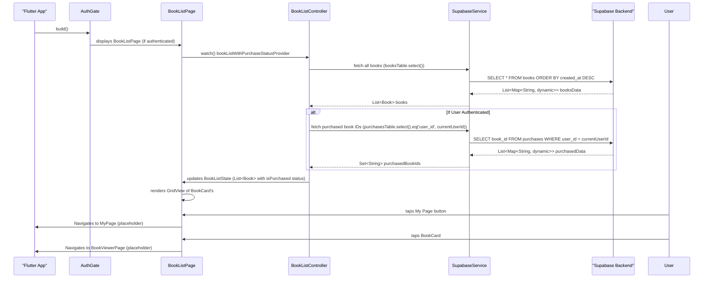

# MODIFICATION_DESIGN.md

**1. Overview**
This document outlines the design for implementing the Book List feature in the Flutter application. This feature will display a list of available books, handle different UI states (loading, error, empty), and enable navigation to book details or other sections of the app. It will also reflect the user's purchase status for each book.

**2. Problem Analysis**
The current `BookListPage` is a placeholder with static content and doesn't fetch actual book data or handle dynamic states. The goal is to replace this placeholder with a fully functional Book List as described in `docs/specs/book-list.md`. This involves:
*   Fetching book data from Supabase.
*   Fetching user's purchase data from Supabase (if authenticated).
*   Dynamically rendering a list of `BookCard` widgets.
*   Displaying appropriate UI for loading, error, and empty states.
*   Implementing navigation to `BookViewerPage` and `MyPage`.

**3. Alternatives Considered**

*   **Single Supabase Query for Books and Purchases:**
    *   **Description:** Attempt to join `books` and `purchases` tables directly within a single Supabase query using `.select('*, purchases(*)')`.
    *   **Pros:** Potentially fewer network requests.
    *   **Cons:** Complexity in filtering purchases for the current user within a single query, especially if `user_id` needs to be dynamically added as a filter on the joined table. It might also return duplicate book entries if a book has multiple purchase records (though `purchases` table structure suggests `(user_id, book_id)` as PK, preventing this). More importantly, fetching purchases is conditional on user authentication, making a single rigid join less ideal.
    *   **Decision:** Rejected. Performing separate queries for `books` and `purchases` and combining them in the app provides more flexibility and cleaner separation of concerns, especially with conditional purchase fetching.

*   **Separate Queries and Client-Side Merging (Chosen Approach):**
    *   **Description:** Fetch all `books` in one query and, if the user is authenticated, fetch all their `purchases` in a separate query. Then, merge this information client-side to determine the `isPurchased` status for each `Book`.
    *   **Pros:** Clear separation of concerns, easier to handle conditional fetching of purchases, simpler query logic for each table.
    *   **Cons:** Potentially two network requests instead of one (though often cached by Supabase and client), slight overhead for client-side merging (negligible for typical book list sizes).
    *   **Decision:** This approach is chosen for its clarity, flexibility, and alignment with the conditional nature of purchase data.

**4. Detailed Design**

**Goal:** Implement the Book List feature to display all available books, reflecting user purchase status, and providing navigation.

**Components Overview:**
*   **`Book` Model:** Already exists (`lib/features/books/models/book.dart`). It will be enhanced if needed to include `isPurchased` property or handled externally.
*   **`BookCard` Widget:** Already exists (`lib/features/books/widgets/book_card.dart`). It will be updated to receive `isPurchased` as an input.
*   **`BookListPage` Widget:** (`lib/features/books/pages/book_list_page.dart`) This widget will be enhanced to display the fetched book data.
*   **`BookListController`:** (`lib/features/books/providers/book_providers.dart`) This `Notifier` will manage the state for fetching books and purchases.
*   **New Providers:**
    *   `booksProvider`: `FutureProvider` to fetch all `Book` objects.
    *   `purchasedBookIdsProvider`: `FutureProvider` to fetch `Set<String>` of purchased `book_id`s for the current user.
    *   `bookListWithPurchaseStatusProvider`: A combination of `booksProvider` and `purchasedBookIdsProvider` (if authenticated) to provide `List<Book>` with `isPurchased` status.

**Book Data Model (`Book` in `lib/features/books/models/book.dart`):**
The existing `Book` model needs to be updated to have a `Book.fromMap` constructor and a `copyWith` method to simplify data handling. Also, it might be beneficial to make it immutable using `freezed` or a similar package, but for MVP, we'll keep it simple.

**BookCard Widget (`lib/features/books/widgets/book_card.dart`):**
*   The `BookCard` will receive an additional `bool isPurchased` parameter.
*   The UI will be updated to display a "Purchased" badge or similar indicator based on `isPurchased`.

**BookListPage Widget (`lib/features/books/pages/book_list_page.dart`):**
*   **AppBar:**
    *   Title: "책 목록" (Book List) or app name.
    *   Actions: `IconButton` for "My Page" navigation.
*   **Body:**
    *   Uses `AsyncValue` from `bookListWithPurchaseStatusProvider` to handle states.
    *   **Loading State:** `CircularProgressIndicator` (central).
    *   **Error State:** Error message with a "Retry" button.
    *   **Empty State:** Custom UI (icon, "등록된 책이 없습니다." message).
    *   **Data State:** `GridView.builder` to display `BookCard`s.
        *   `gridDelegate: SliverGridDelegateWithFixedCrossAxisCount(crossAxisCount: 2)`.
        *   `BookCard`'s `onTap` will navigate to `BookViewerPage`.

**Data & Backend Behavior:**
*   **Fetch Books:**
    *   Query `SupabaseService.instance.client.from('books').select()`.
    *   Order by `created_at DESC` as per spec recommendation.
    *   Map the results to `List<Book>`.
*   **Fetch Purchases (Conditional):**
    *   If `isAuthenticatedProvider` is true, query `SupabaseService.instance.client.from('purchases').select().eq('user_id', currentUser.id)`.
    *   Extract `book_id` from the results and store in `Set<String> purchasedBookIds`.
*   **`BookListController` (`NotifierProvider`):**
    *   Manages `BookListState` (`List<Book> books`, `bool isLoading`, `String? error`).
    *   Includes an `fetchBooks` method that performs the Supabase queries, combines data, and updates the state.

**State Management (Riverpod):**
*   **`booksProvider` (`FutureProvider<List<Book>>`):**
    *   Reads `SupabaseService.instance.client`.
    *   Fetches all books from the `books` table.
*   **`purchasedBookIdsProvider` (`FutureProvider<Set<String>>`):**
    *   Depends on `isAuthenticatedProvider` and `currentUserProvider`.
    *   If authenticated, fetches `book_id`s from the `purchases` table for the current user.
    *   Returns an empty `Set` if not authenticated.
*   **`bookListWithPurchaseStatusProvider` (`FutureProvider<List<Book>>`):**
    *   Combines results from `booksProvider` and `purchasedBookIdsProvider`.
    *   Iterates through each `Book`, setting its `isPurchased` flag based on `purchasedBookIds`.
    *   This will be the main provider consumed by `BookListPage`.

**Navigation:**
*   **My Page:** `IconButton` in `AppBar` will navigate to `MyPage`. This will be a placeholder initially, possibly just a `debugPrint` or a `showSnackbar`.
*   **Book Viewer:** Tapping `BookCard` will navigate to `BookViewerPage`, passing the `Book` object or `bookId`. This will also be a placeholder initially.

**5. Diagrams**

```mermaid
graph TD
    subgraph UI Layer
        BookListPage --> AppBar
        BookListPage --> BookCard
    end

    subgraph State Management (Riverpod)
        BookListPage --> bookListWithPurchaseStatusProvider
        bookListWithPurchaseStatusProvider --> booksProvider
        bookListWithPurchaseStatusProvider --> purchasedBookIdsProvider
        purchasedBookIdsProvider --> isAuthenticatedProvider
        purchasedBookIdsProvider --> currentUserProvider
    end

    subgraph Data Layer (SupabaseService)
        booksProvider --> SupabaseService
        purchasedBookIdsProvider --> SupabaseService
    end

    subgraph Supabase Backend
        SupabaseService --> BooksTable
        SupabaseService --> PurchasesTable
        SupabaseService --> AuthUser
    end

    AuthGate --> BookListPage
    BookCard --tap--> BookViewerPage (placeholder)
    AppBar --> MyPage (placeholder)
```



**6. Summary**
The Book List feature will be implemented by fetching book data and user purchase data separately from Supabase and merging them client-side. Riverpod will manage the state, providing books with their purchase status to the `BookListPage`. The `BookListPage` will render a `GridView` of `BookCard`s, handling loading, error, and empty states, and providing navigation placeholders.

**7. References**
*   `docs/specs/book-list.md`
*   `docs/architecture.mdc`
*   Supabase Flutter Querying Data: [https://supabase.com/docs/reference/dart/select](https://supabase.com/docs/reference/dart/select)
*   Supabase Flutter Filtering: [https://supabase.com/docs/reference/dart/filter](https://supabase.com/docs/reference/dart/filter)
